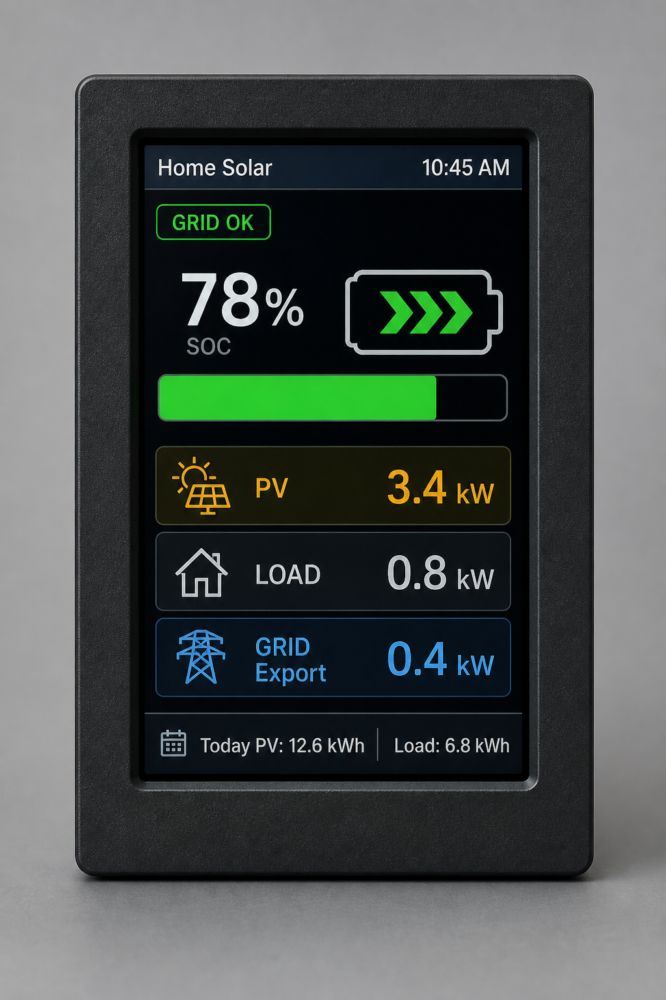
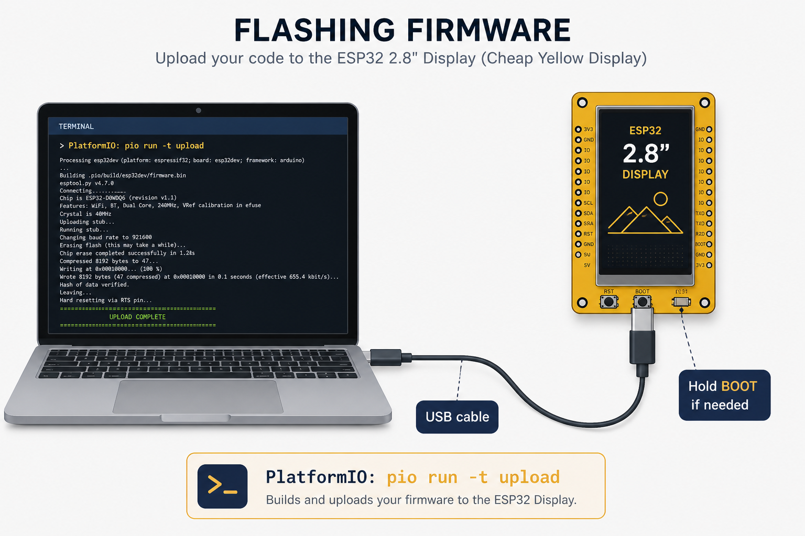
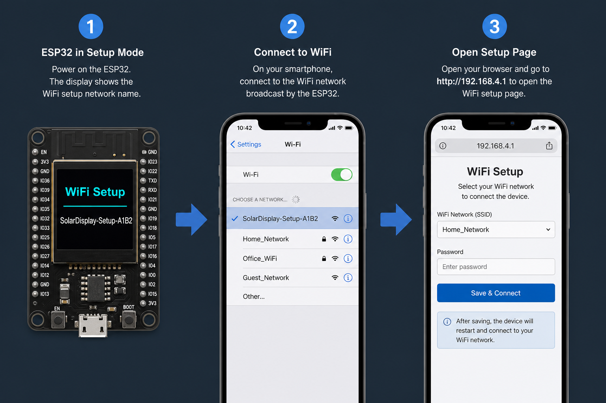

<p align="center">
  <strong>Solar Monitoring Viewer</strong>
</p>

<h1 align="center">Solar Monitoring Viewer (ESP32)</h1>

<p align="center">
  <a href="https://opensource.org/licenses/MIT"></a>
  <a href="https://platformio.org/"></a>
</p>

<p align="center">
Official companion display for <a href="https://github.com/jcvsite/solar-monitoring">solar-monitoring</a> — local 2.8″ wall/desk glance UI with no cloud dependency.
</p>

# Solar Monitoring Viewer (ESP32)

Local wall/desk display for **[solar-monitoring](https://github.com/jcvsite/solar-monitoring)**.  
Runs on common **2.8″ ESP32 + ILI9341** boards (Cheap Yellow Display / ESP32-2432S028 class).

<p align="center">
  
</p>

> The photo above is an **early design mockup**. The firmware UI is simpler and matches the layout below (dark theme, text labels `PV` / `LD` / `GR`, bottom tab bar).

**Actual Glance screen (portrait 240×320):**

```text
┌──────────────────────────────┐
│ My Home Solar    ☀ 32°C  3:36 PM │  title + weather + server clock
│ ● GRID OK  (or alert bar)    │  grid status chip
│   [icon]        78%          │  battery + large SOC
│ ████████░░░░  SOC bar        │
│        Charging 450 W        │
│ PV   PV              3.4 kW  │
│ LD   LOAD            0.8 kW  │
│ GR   GRID         OK 120 W   │
│ Today PV 12.6   Load 6.8     │
│ Inverter: Normal             │
│ Glance   BMS   Hist   Set    │  touch tabs
└──────────────────────────────┘
```

| | |
|---|---|
| **What it does** | Shows live SOC, PV / load / grid, BMS detail, and a simple history sparkline |
| **How it talks** | HTTP to your solar-monitoring PC (`/api/display`) — no cloud |
| **How you set WiFi** | SoftAP portal on first boot (phone browser) — no hardcoded password required |
| **Many boards?** | Yes — each device has a unique setup AP name |
| **Layouts / themes** | 5 glance layouts × portrait/landscape; 5 themes — pick on device or host web |
| **OTA updates** | Via solar-monitoring host proxy from GitHub Releases |

Repository: **https://github.com/jcvsite/Solar-monitoring-viewer-esp32**

---

## What you need

1. A **2.8″ ESP32 display** (ILI9341, 240×320, USB-C) — CYD-style boards work with the default pin map  
2. A PC or Pi running **solar-monitoring** with the web dashboard on (default port **8081**)  
3. Same WiFi / LAN for both  
4. USB cable for flashing  

On the host (`config.ini`):

```ini
[GENERAL]
SYSTEM_TITLE = My Home Solar
LOCAL_TIMEZONE = Asia/Manila

[WEATHER]
ENABLE_WEATHER_WIDGET = True
WEATHER_DEFAULT_LATITUDE = 16.6167
WEATHER_DEFAULT_LONGITUDE = 120.3166

[WEB_DASHBOARD]
ENABLE_WEB_DASHBOARD = true
WEB_DASHBOARD_PORT = 8081
ENABLE_MDNS = true
MDNS_HOSTNAME = solar-monitoring
```

---

## Flash the firmware (easiest for most people)

<p align="center">
  
</p>

### Browser install (recommended)

This is the normal-user path. No PlatformIO or Arduino IDE is needed on the end-user PC.

1. Get a ready-to-use `webflash` package from the project release or CI artifact.
2. Extract it.
3. In that folder, start a small local web server:

```bash
python -m http.server 8765 --directory webflash
```

4. Open **http://localhost:8765** in **Chrome** or **Edge**.
5. Plug in the display with a USB **data** cable.
6. Click **Install firmware**.
7. Choose the serial port and confirm the install.

After flashing, continue with the on-screen WiFi setup in the next section.

> **For maintainers:** the `webflash` package is produced from the firmware build and can be published in releases. CI under [`.github/workflows/esp32-display-firmware.yml`](../.github/workflows/esp32-display-firmware.yml) uploads a `solar-glance-webflash` artifact.

### Developer upload (fallback)

```bash
pio run -t upload
pio device monitor
```

If upload fails, hold **BOOT**, start upload, release when writing begins.  
Default pins match common CYD 2.8″ boards (`platformio.ini`). Change `build_flags` if your seller’s wiki differs.

---

## First-time WiFi setup

No need to edit `secrets.h` for normal use.

<p align="center">
  
</p>

1. Power the display (USB). The screen shows **WiFi Setup**.  
2. On your phone, join the open AP named like **`SolarDisplay-Setup-A1B2`**  
   (suffix is unique per board — set up **one device at a time**).  
3. Open the captive portal, or browse to **http://192.168.4.1**.  
4. Select your home WiFi, enter the password, save.  
5. The display joins your LAN, then searches for solar-monitoring (**mDNS**, then subnet scan).  

Credentials are stored in flash. To change WiFi later: **Settings → WIFI SETUP**.

Optional: put SSID/password in `include/secrets.h` (from `secrets.h.example`) as a factory fallback.

---

## Using the display

Touch the bottom tabs:

| Tab | What you see |
|-----|----------------|
| **Glance** | Title, **weather icon + temperature** (when weather is enabled on the host), **clock in the host's `LOCAL_TIMEZONE`**, large **SOC**, PV / Load / Grid, today kWh. **Pulsing red/orange bar** on no-grid / brownout |
| **BMS** | Pack voltage/current/power, temps, cell delta, cell bar strip |
| **Hist** | PV & load sparkline + today’s energy totals |
| **Set** | Host IP, **FIND** (discover), **SAVE**, **WIFI SETUP** |

```text
ESP32 display  --HTTP GET /api/display-->  solar-monitoring :8081
               --mDNS _solar-monitoring._tcp--^
```

---

## Multiple displays

Supported. Each board has its own SoftAP name and hostname (from chip ID).  
All can poll the same solar-monitoring host — the APIs are stateless.

---

## Troubleshooting

| Symptom | What to try |
|---------|-------------|
| Upload fails | Hold **BOOT**, retry; check COM port; try a data-capable USB cable |
| Stuck on WiFi Setup | Join the exact AP name on the screen; try `192.168.4.1` manually |
| WiFi OK but no data | Confirm host web dashboard is running; Settings → **FIND**; same LAN/VLAN |
| Wrong colors / white screen | Pin map mismatch — check seller wiki vs `platformio.ini` |
| Touch not working | CYD uses a **separate SPI bus** for touch (GPIO 25/32/39/33/36). See [CYD TouchTest](https://github.com/witnessmenow/ESP32-Cheap-Yellow-Display/tree/main/Examples/Basics/2-TouchTest). Tune `TOUCH_MAP_*`, `TOUCH_SWAP_XY`, `TOUCH_MIRROR_X/Y` in `include/config.h` |
| Touch upside down / offset | Adjust `TOUCH_MIRROR_X` / `TOUCH_MIRROR_Y` / `TOUCH_SWAP_XY` in `include/config.h` |

---

## For developers

- APIs: `GET /api/display`, `/api/display/bms`, `/api/display/history?hours=24`  
  Glance payload includes `clock`, `timezone`, `tz_offset_sec`, and `weather` (Open-Meteo, cached on the host).  
  The display uses the host timezone for NTP and shows the server `clock` string in the header.
- Discovery: mDNS service `_solar-monitoring._tcp` (TXT includes `api_version`, paths)  
- Stack: PlatformIO, TFT_eSPI, ArduinoJson, WiFiManager, XPT2046  

**Split to its own repo:** copy this folder; keep the HTTP + mDNS contract documented — no Python code is required in that repo.

Home Assistant auto-discovery via the same mDNS TXT is planned as a **separate** custom-component project.
